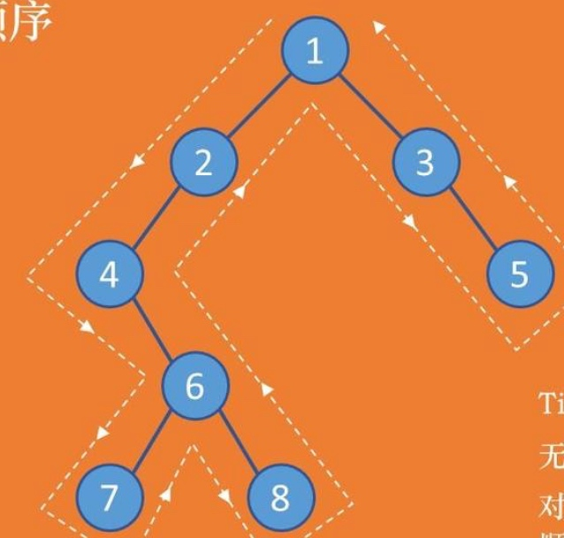
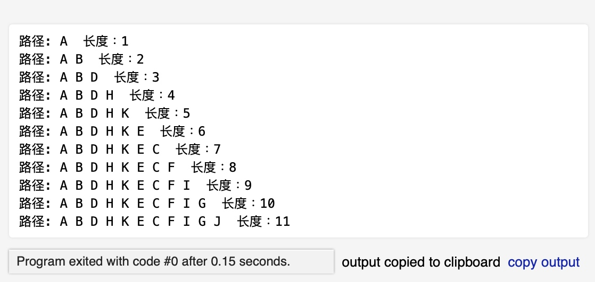
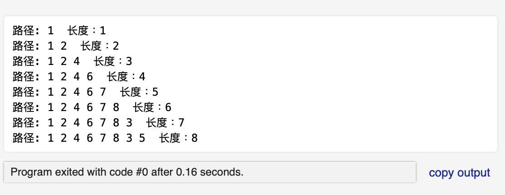

# 数据结构实验报告
## 第二次上机
## 一、实验目的及要求
### 实验内容
#### 题目 1 二又树中根结点到所有其他结点的路径及路径长度问题

####实验目的
验证二叉树及其上的基本操作

####实验内容及要求
 1、定义二又树类 
 2、实现如下功能：
①根据老师输入的测试数据（整型）从无到有创建一棵二又树 Reel 
②求根结点到二又树中所有其他结点的路径及路径长度并打印输出。
3、为便于观察程序的运行结果，设计的输出函数能在屏幕上以规范、直观的形式输出计算结果。例如将路径输出成如下形式：1->2>3->4>5 
4、为了增强程序的可读性，程序中要有适当的注释

####题目 2 图遍历算法实验目的
####实验目的
验证图的深度优先遍历与广度优先海历算法。实验内容及要求
####实验内容及要求
1. 输入一个有向图的顶点数 n 和边数 e，设图中项点编号为 1 到 n,
1) 依次输入每个边的起点和终点，创建该图的邻接表
2) 边链表中边结点编号按照从小到大的顺序存储。
1. 实现图的深度优先遍历和广度优先追历，输入顶点序号 v，给出 1 中有向图
2. 为增强程序的可读性，程序中要有适当的注释

## 二、实验设备软件
操作系统：MacOS
程序语言：C
## 三、实验过程
### 题目一 二又树中根结点到所有其他结点的路径及路径长度问题
#### 算法设计
二叉树以它的先根遍历序列的字符串的形式表示，用“#”表示空树。
##### 定义栈
定义一个栈来辅助二叉树的先根遍历
````
// 栈结构
typedef struct stack
{
    BiTNode *elements[50];
    int top;
}seqstack;

seqstack s;
//初始化栈
void init(){ 
    s.top = 0;
}
//入栈
void Push(BiTNode *temp){
    s.top ++;
    s.elements[s.top] = temp;
}
// 出栈
BiTNode *Pop(){
    BiTNode *temp = s.elements[s.top];
    s.top--;
    return temp;
}
````
##### 定义结构体：二叉树结点
二叉树有数据域，左子节点，右子节点
````
typedef struct BiTNode{
    TElemType data; // 数据域
    struct BiTNode *lchild, *rchild; // 左右子节点
}BiTNode, *BiTree;
````
##### 函数：初始化二叉树
初始化，二叉树根节点指向空
````
int InitBiTree(BiTree *T){
    *T = NULL;
    return 0;
}
````
##### 函数：创建二叉树
读取整个二叉树先根遍历字符串，遇到“#”就跳过
遇到不为“#”的字符就创建一个新节点
````
// '#' 表示空树，构建二叉链表表示二叉树 T
int CreateBiTree(BiTree *T){
    TElemType ch;
    ch = str[indexx++];
    
    if (ch == '#')
        *T = NULL; // 跳过“#”
    else{
        *T = (BiTree)malloc(sizeof(BiTNode));//  分配内存
        
        if(!*T) 
            exit(OVERFLOW); // 异常情况
            
        // 构建新节点
        (*T) -> data = ch;
        CreateBiTree(&(*T) -> lchild); // 构建左子树
        CreateBiTree(&(*T) -> rchild); // 构建右子树
    }
    return 0;
}
````
##### 函数：先根遍历二叉树
采用二叉树的非递归先根遍历方法。
输入二叉树，以及节点序号。
非递归先根遍历二叉树，打印出每个访问节点，直到访问到目标节点。
节点序号即路径长度。
````
int PreOrder(BiTree T, int location){
    BiTree temp = T;
    int visit = 0;
    while(temp != NULL || s.top != 0 ){

        while(temp != NULL)// 先遍历左子树；
        {
            if(visit == location) {
                return 0;//访问到目标节点
            }
            printf("%c ", temp -> data);
            visit++;
            Push(temp); //当前节点入栈
            temp = temp -> lchild;
        }
        if (s.top != 0){
            temp = Pop(); // 弹出一个节点
            temp = temp -> rchild;
        }
    }
return 0;
}

int PreOrderVisit(BiTree T,int location){
	PreOrder(T,location);
    printf(" 长度：%d\n",location);
	return 0;
}
````

#### 测试数据设计
1. 二叉树先根遍历序列：`"ABDH#K###E##CFI###G#J##"`
2. 二叉树先根遍历序列：`"124#67##8###3#5##"`


#### 测试结果截屏
测试1

测试2:

